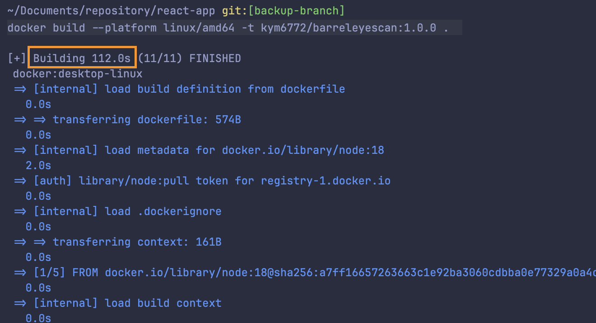
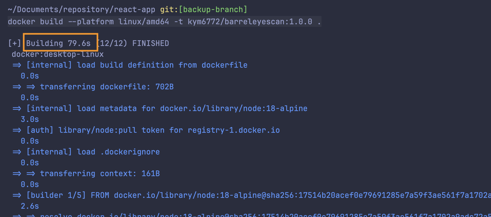

Docker를 활용해 Node.js 애플리케이션을 컨테이너화할 때, 효율적인 Dockerfile을 작성하는 것은 필수이다. 비효율적으로 작성된 Dockerfile은 불필요하게 큰 이미지 크기와 느린 빌드 시간을 초래할 수 있어, 프로젝트 전반에 걸쳐 영향을 미칠 수 있다. 이번 글에서는 Dockerfile을 최적화하여 Node.js 애플리케이션의 이미지 크기를 줄이고 빌드 속도를 높이는 방법을 공유해보려고 한다.

## 들어가기 앞서

배포를 진행할 때마다 디스크 용량 부족으로 인해 빌드가 실패하는 문제가 발생했다. 디스크 용량을 단순히 늘리는 것도 하나의 해결책이 될 수 있지만, 장기적으로는 최적화를 통해 이 문제를 해결하는 것이 더 낫다고 판단했다. 그래서 Docker 이미지의 크기를 줄여 최적화하는 방법을 모색하게 되었고, 그 과정을 이번 글에서 공유해보려고 한다.


## 기존 Dockerfile의 문제점

배럴아이스캔 프로젝트의 Dockerfile은 다음과 같이 작성되어 있었다.

```
FROM node:18

WORKDIR /app
COPY package.json .
RUN npm install
COPY . .

ENV NODE_ENV [NODE_ENV]
ENV VITE_API_SERVER_URL [VITE_API_SERVER_URL]

CMD ["npm", "run", "start:prod"]

```

이 Dockerfile은 몇 가지 중요한 문제를 안고 있다.

1. **불필요하게 큰 기본 이미지**: `node:18` 이미지는 여러 기능을 포함하고 있어 이미지 크기가 크다. 이는 빌드 시간뿐만 아니라 배포 시간에도 영향을 미친다.
2. **비효율적인 캐시 활용**: 모든 소스 코드를 복사한 후 `npm install`을 실행하면, 코드의 작은 변경 사항에도 모든 종속성을 다시 설치하게 되어 비효율적이다.

## 최적화된 Dockerfile 작성하기

이제 위의 문제를 해결한 최적화된 Dockerfile을 작성해보려고 한다.

```
# Stage 1: Builder
FROM node:18-alpine as builder

WORKDIR /app

COPY package.json package-lock.json ./
RUN npm install --production

COPY . .

# Stage 2: Runner
FROM node:18-alpine as runner

WORKDIR /app

COPY --from=builder /app .

ENV NODE_ENV=[NODE_ENV]
ENV VITE_API_SERVER_URL=[VITE_API_SERVER_URL]

CMD ["npm", "run", "start:prod"]

```

## 구성

### 1. Alpine 기반 이미지 사용

기존 Dockerfile에서 사용된 `node:18` 대신, 훨씬 가벼운 `node:18-alpine` 이미지를 사용했다. Alpine은 최소한의 패키지만 포함하는 경량 리눅스 배포판으로, Docker 이미지의 크기를 크게 줄일 수 있다. 그 결과, 빌드 속도와 배포 속도가 눈에 띄게 개선된다.

### 2. 멀티스테이지 빌드

Dockerfile을 멀티스테이지 빌드로 구성하여 빌드와 실행 환경을 분리했다. 첫 번째 스테이지(`builder`)에서는 종속성을 설치하고, 두 번째 스테이지(`runner`)에서는 빌드된 파일만 포함해 최종 이미지를 생성한다. 이 방식은 최종 이미지에 불필요한 빌드 도구가 포함되지 않도록 해 이미지 크기를 최소화할 수 있다.

### 3. 효율적인 캐시 활용

`package.json`과 `package-lock.json` 파일을 먼저 복사한 후 `npm install`을 실행하는 방식으로 Docker의 캐시 기능을 최대한 활용했다. 이렇게 하면 종속성에 변경이 없을 때, 빌드 속도가 현저히 빨라진다.

## 배럴아이스캔 이미지 사이즈 전/후 결과

이 최적화된 Dockerfile을 사용함으로써 이미지 크기를 줄이고, 빌드와 배포 시간을 단축하는 데 성공했다. 특히, 배럴아이 프로젝트처럼 작은 용량의 서버를 사용하고 있는 경우, 이러한 최적화는 배포 시간을 단축시키고, 서버 용량을 효율적으로 관리하는 데 크게 도움이 된다.

### 빌드시간

Dockerfile 변경 후 빌드 시간이 112초 → 79.6초로 **32.4초** 감소했다.





### 이미지 사이즈

Dockerfile 변경 후 이미지 사이즈가 2.26GB → 427MB로 **1.833GB** 축소되었다.


### 디스크 사용량

Dockerfile 변경 전 디스크 사용량이 97%정도로 아슬아슬하게 사용하고 있었다. 변경 후 67%로 감소 되었다.


### 끝으로

CI/CD 자동화를 진행하면서 배포 중 용량 부족 문제를 겪었고, 이를 해결하기 위해 일시적으로 용량을 늘려 배포를 진행했었다. 이번에 Dockerfile을 최적화하여 이미지 크기를 줄이는 작업을 진행했는데, 단순한 수정만으로도 이미지 크기가 크게 감소하는 효과를 경험할 수 있었다.
